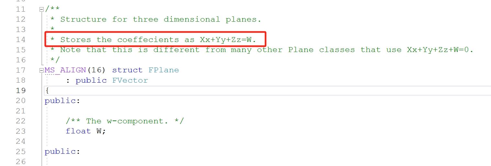
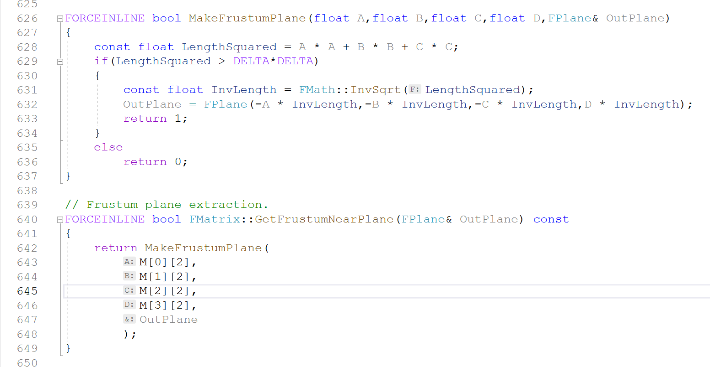
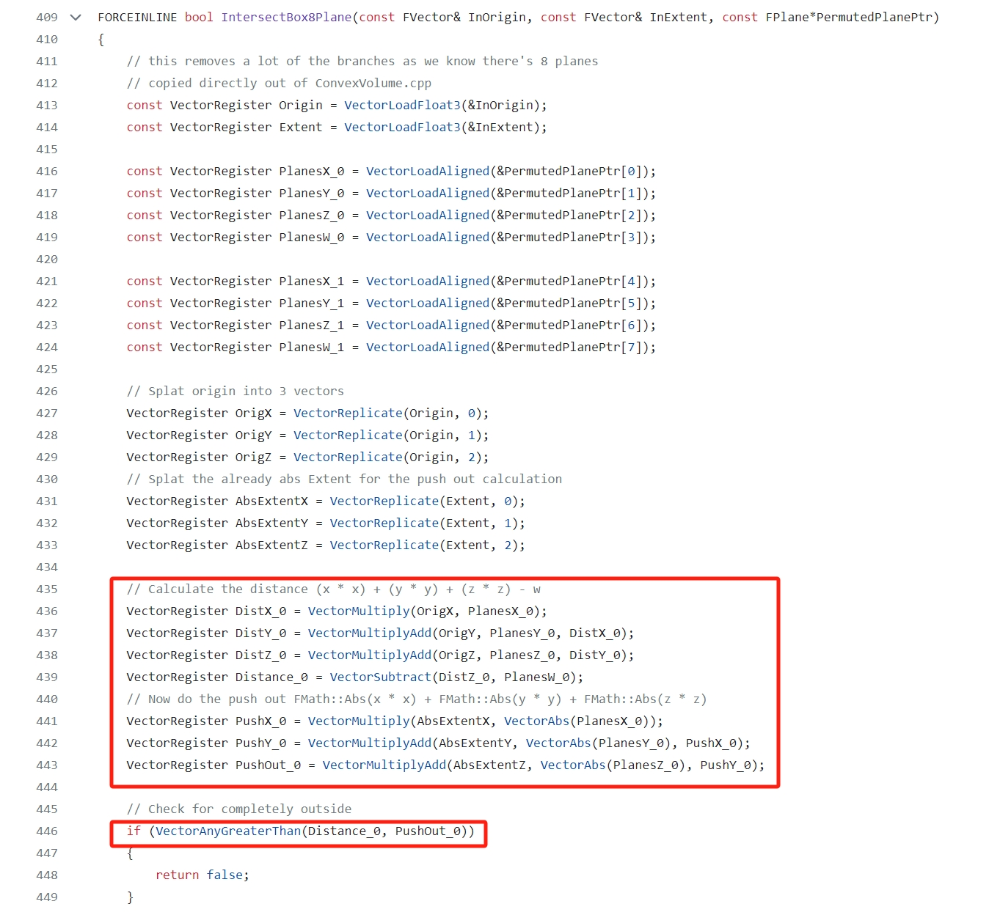

# UE4 Case in InitViews
UE4中Frustum放在FSceneRenderer中的Views（FViewInfo，继承自FSceneView）中，具体点就是通过FSceneView::ViewFrustum(FConvexVolume)变量来维护，包含6个平面。看一下平面的定义FPlane，UE4中一个平面的定义又XYZ的三维向量和常数W组成，从代码注释中可以看到，对应平面方程Xx+Yy+Zz=W的四个系数，注意W在方程式的右边。（X, Y, Z)是平面的法线，-W为原点到平面的有符号距离（signed distance，法线为单位法线的时）。
<!-- {:height="50%" width="50%"} -->

FSceneView::ViewFrustum通过SetupViewFrustum调用GetViewFrustumBounds完成初始化，从ViewProjectionMatrix矩阵中生成frustum的6个平面表达[^1]。值得一提的是，平面的法向设置为朝的方向，这最终也影响FrustumCull剔除中实际的实现。
<!-- {:height="50%" width="50%"} -->
<!--  -->

FrustumCull首先有一个以距离为Cull标准的distance cull，然后是frustum和primitive的包围盒(AABB, Bounding Sphere)的相交测试，这里只关注AABB的求教，BS的大同小异。naive的方法就是AABB的8个顶点遍历一遍，计算每个顶点和6个平面的距离，判断顶点是在平面的内侧还是外侧；如果8个顶点都在平面的外侧，那整个包围盒就都在frustum外面，就可以放心的剔除该包围盒对应的Primitive了。UE4的快速FrustumCull实现，在IntersectBox8Plane中实现使用了两处优化，1）SSE的加速，SIMD，同一条指令同时计算4个平面的相交；2）计算包围盒顶点的最大距离，如果最大距离的点在平面外侧，整个包围盒即在平面的外侧，但由于UE4中视锥体平面的法线是指向视锥体外侧的，这个优化就变成了求最小距离。
包围盒的中心点为$`(O_x, O_y, O_z)`$，包围盒大小的一半为$`(E_x, E_y, E_z)`$，顶点为$`(O_x \pm E_x, O_y \pm E_y, O_z \pm E_z)`$，那么顶点到平面的距离为
$$(O_x \pm E_x) * X + (O_y \pm E_y) * Y + (O_z \pm E_z) * Z - W = (O_x * X + O_y * Y + O_z * Z - W) + (\pm E_x * X \pm E_y * Y \pm E_z * Z)$$
令$`D_o =  (O_x * X + O_y * Y + O_z * Z - W)`$, $`D_e = |E_x| * X + |E_y| * Y + |E_z| * Z`$
其中$`(\pm E_x * X \pm E_y * Y \pm E_z * Z) \in [-D_e, D_e]`$, 包围盒顶点到平面的最小距离为$`D_{min} = D_o - D_e`$, 如果$`D_{min} > 0`$，包围盒必然在视锥体外，可以安全剔除。

<!-- $$\left( \sum_{k=1}^n a_k b_k \right)^2 \leq \left( \sum_{k=1}^n a_k^2 \right) \left( \sum_{k=1}^n b_k^2 \right)$$ -->
[^1]: Fast Extraction of Viewing Frustum Planes from the World-View-Projection Matrix
[^2]: 

